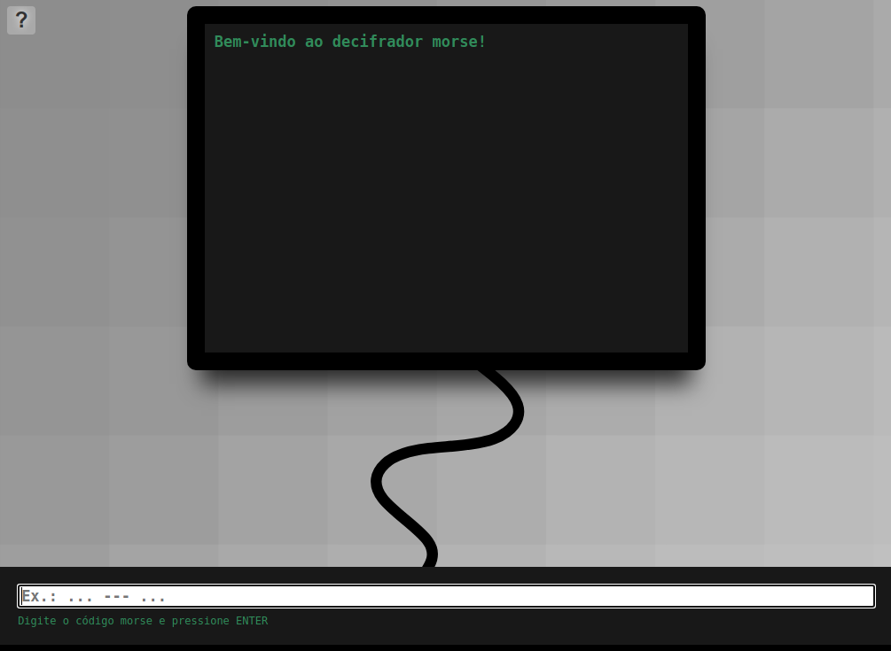
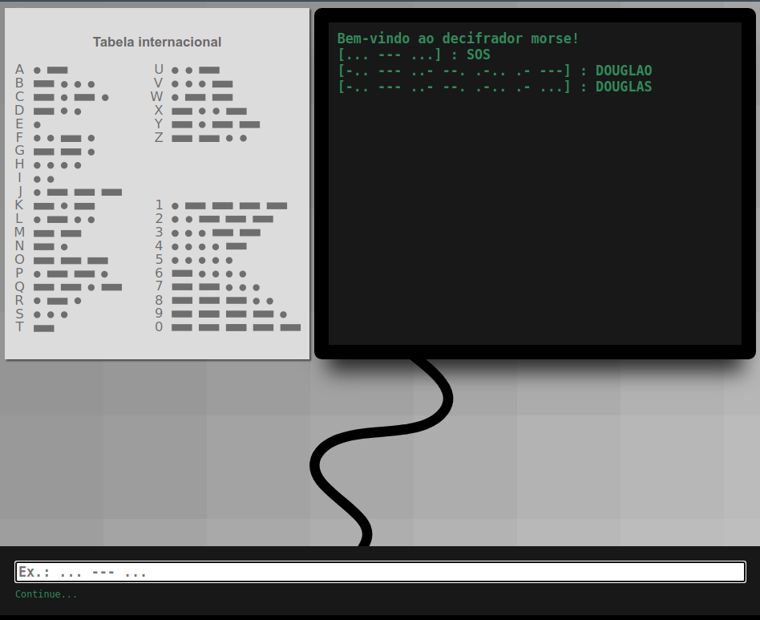
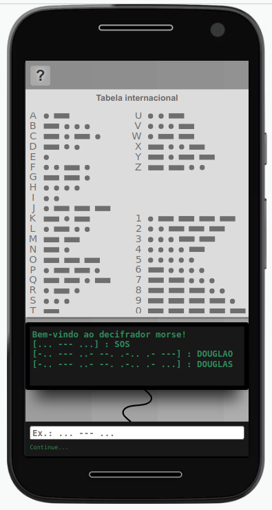
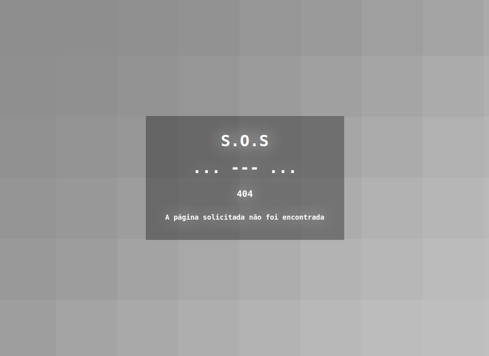

# MORSE

## Descrição

Esta é uma aplicação simples para decifrar [código Morse](https://ethw.org/Morse_Code), desenvolvida  nos dias 18 e 19 de novembro, com o [*framework Flask*](https://flask.palletsprojects.com/) e comunicação [*web socket*](https://html.spec.whatwg.org/multipage/web-sockets.html). Para facilitar a comunicação, foi utilizada a biblioteca [`socket.io javascript`](https://github.com/socketio/socket.io) e [`Flask-SocketIO python`](https://flask-socketio.readthedocs.io/en/latest/). Por simples, a interface do usuário também foi feita de forma básica, sem uso de *frameworks javascript* de prototipação e *design*. Apesar de ser limitado a `HTML`, `css` e `javascript` padrão, a *interface* gráfica é estética, flexível e responsiva, adaptando-se de forma fluida aos dispositivos móveis e os mais variados tamanhos e resoluções.

## Fluxo de funcionamento

Em uma janela de navegador, o usuário dispõe de apenas um *input*, que já se encontra em foco, no qual é instruído a digitar um código morse válido. Para auxiliar o trabalho do usuário, no canto superior esquerdo desta janela, encontra-se um botão de ajuda, que ao ser pressionado, exibirá a tabela informativa internacional do código morse.

Ao receber *inputs* do usuário, os dados são avaliados por [expressão regular](https://developer.mozilla.org/en-US/docs/Web/JavaScript/Guide/Regular_Expressions), de modo que um conjunto válido de pontos e traços é interpretado como código morse e separado para ser emitido para o *backend* [Python](https://www.python.org/) via *web socket* no momento em que o usuário pressiona `ENTER`.

Ao receber os dados, o *python* separa o texto em blocos de código morse, que são validados de acordo com um [dicionário constante](https://docs.python.org/3/tutorial/datastructures.html#dictionaries). Caso o bloco represente uma letra ou um número, este é reservado e então retornado em forma de palavra ou frase para o *frontend*. Este retorno é tratado de modo simples, sendo exibido em uma representação gráfica de um *display* virtual.

Nem todas as combinações de pontos e traços representam um código morse internacional. A combinação de quatro traços `----`, por exemplo não está prevista na [tabela padrão internacional](https://ethw.org/Morse_Code) e por isto é avaliada e tratada no *backend* com um [`ValueError`](https://docs.python.org/3/tutorial/errors.html#raising-exceptions) informativo.

## Descrição da arquitetura

### Código

Como esta aplicação foi desenvolvida em dois dias e tem o objetivo unidirecional de traduzir o código para a leitura humana, sem fazer uso de banco de dados, a opção mais interessante foi manter a simplicidade de arquitetura do código, lançando mão do *microframework Flask*, por exemplo, ao invés de *frameworks* mais robustos, como [Django](https://www.djangoproject.com/), mantendo os *scripts* simples, claros, coesos, manuteníveis e separados por responsabilidade, de modo que o incremento de funcionalidades da aplicação seja perfeitamente possível sem grandes esforços.

Os testes unitários foram implementados para garantir o correto funcionamento da única inteligência da aplicação: o método tradutor.

Para servir as páginas especificadas por [WSGI](https://en.wikipedia.org/wiki/Web_Server_Gateway_Interface) e cuidar da comunicação entre as camadas, foi usado o [Green Unicorn - gunicorn](https://gunicorn.org/), que é um senso comum para aplicações *python/web*.

Para empacotar código e dependências, foi utilizado uma solução de [container Docker](https://www.docker.com/), que facilita a portabilidade de execução entre as plataformas.

### Infraestrutura

#### 1. Simples localmente

Da maneira em que a aplicação foi desenvolvida e empacotada, a mesma pode ser executada em um servidor local com uma configuração básica e um sistema operacional com o `Docker` instalado.

#### 2. Computação em nuvem

Para a implantação em nuvem, foi utilizado uma conta gratuita [Heroku](https://id.heroku.com), onde foi criada uma aplicação simples e implantado o *container*.

Por ser uma aplicação simples, ao usar a forma gratuita do *Heroku*, existe um comportamento similar à hibernação das funções *lambda*, gerando lentidão e notada indisponibilidade no primeiro acesso.[^lambda]

## Acessando o sistema

A aplicação *web* pode ser acessada através do link: https://morse-douglas.herokuapp.com

É relevante notar o comportamento similar às funções lambda, citado no tópico anterior.[^lambda]

## Obtendo o sistema

Para testes e alterações locais, o sistema pode ser utilizado conforme instruções abaixo:

### Pré-requisitos

- Sistema operacional com compatível com o `Docker`;
- `Docker` instalado e configurado;
- Cliente `git` instalado e configurado.

### Instalação

Em um terminal, execute os comandos abaixo:

- `git clone git@github.com:doug-cpp/morse.git`
- `docker build -t morse-doug .`

### Execução

No terminal, execute o comando:

- `docker run -d --name morse-doug -p 8080:8080 morse-doug`
- Abra um navegador e acesse o link `http://localhost:8080`

---

## Arquitetura ideal

### Aplicação

Como processo de escalonamento, é essencial separar o código em conceitos de *frontend* e *backend*, para que o desenvolvimento de complexidade se torne independente e desacoplado, otimizando a manutenção do sistema.

Em grande escala é essencial utilizar um *message broker*, como o [RabbitMQ](https://www.rabbitmq.com/) ou similar, para momentos em que o *backend* esteja *offline*, as mensagens não sejam perdidas (e ainda retorne o temido erro 500). Com o uso de serviços de mensageria, o fluxo prossegue de modo transparente e assim que o *backend* estiver operacional, as mensagens serão consumidas, processadas e respondidas.

Outro ponto importante é a autenticação (idealmente em duplo fator), forjada com mecanismos para evitar que usuários mal intencionados ou [*bots*](https://pt.wikipedia.org/wiki/Bot) possam enviar milhares de requisições (degradando o sistema e forçando um aumento artificial e desnecessário da estrutura), controlando, por exemplo um número máximo de *inputs* por segundo de um mesmo usuário. O escalonamento do *backend* precisa de cuidado especial, pois enquanto o usuário requisita uma vez o *frontend* para usar a aplicação, o *backend* é requisitado várias, por exemplo, neste caso, a cada mensagem enviada.

Através da implantação de um sistema de métricas, poderíamos coletar dados de usuários para um aprendizado contínuo de máquina. Este aprendizado poderia ser usado para identificar e auxiliar na prevenção de fraudes na utilização da aplicação.

Não podemos esquecer de implementar um mecanismo de *log* detalhado para monitoramento de acessos e erros separadamente; isto tornará a manutenção bem mais simples e efetiva.

Devemos seguir o padrão de mercado que impõe a utilização de conexões seguras e criptografadas para tráfego de dados `Https`, onde é necessário instalar certificados [`TSL ou SSL`](https://pt.wikipedia.org/wiki/Transport_Layer_Security) em nosso servidor.

Implantar uma ferramenta de monitoramento de status da aplicação.

Para um código mais íntegro e robusto, faz-se necessário a utilização de testes unitários por parte dos desenvolvedores e testes automatizados executados por profissionais de `QA`.

Um importante componente do processo de desenvolvimento é a implantação de um fluxo de [`CI/CD`](https://en.wikipedia.org/wiki/CI/CD), que pode ser implementado, por exemplo, com as [ferramentas do `gitlab`](https://docs.gitlab.com/ee/ci/).

### Infraestrutura

No mundo moderno, as aplicações precisam contar com grande disponibilidade e um cuidado especial deve ser investido em escalabilidade. É importante salientar que usar uma estrutura própria pode não ser ideal. Geralmente não é viável dispor de equipamentos que exigem manutenção, profissionais dedicados, disponibilidade e *hardware* atualizado constantemente; por isto é necessário lançar mão de serviços de nuvem, que cuidam de todas as responsabilidades mencionadas e ainda permitem rápido escalonamento da estrutura.

A tecnologia da computação virtual [`AWS EC2`](https://aws.amazon.com/ec2) provê capacidade computacional segura e redimensionável, sendo a minha escolha para criação de servidores. Com o serviço [`AWS Auto Scaling`](https://aws.amazon.com/autoscaling) para criar planos de escalabilidade e instâncias pulverizadas em zonas diferentes, garantindo disponibilidade. Ao definir métricas baseadas em consumo, processamento ou tráfego, o serviço pode ser configurado para criar ou excluir automaticamente instâncias de servidores. Como não existe aplicação que use 100% dos recursos 100% do tempo, não podemos deixar de mencionar a grande vantagem na nuvem em não pagar por recurso ocioso.

Para o armazenamento dos estáticos, o serviço de armazenamento [`AWS S3`](https://aws.amazon.com) é uma excelente opção escalonável, de alta velocidade, projetado para *backup* e arquivamento *online*.

Seja qual for o conjunto de ferramentas e serviços escolhidos, é importante ter em mente a otimização; por exemplo, escolhendo data centers de regiões estratégicas, diminuindo a latência de rede, otimizando o tamanho das mensagens, para que os usuários com restrições sejam menos afetados (uma realidade ainda presente em diversas partes do globo). Portanto, caso a aplicação seja usada por usuários finais, é necessário uma preocupação extra com dispositivos móveis, limitação de dados e de transferência, além de levar em consideração a distribuição de servidores, para que os usuários não se conectem em um único ponto.

É necessário prover um sistema eficiente de cadastro de usuário, que seja fácil e eficaz, armazenado em um serviço de banco de dados em nuvem (*DBaaS*), como [`AWS RDS`](https://aws.amazon.com/pt/rds/?nc2=h_ql_prod_fs_rds), que dispõe de *backup* e atualização automáticos, nos isentando também destas responsabilidades.

## Screenshots

---

---

---

---

[^lambda]: A primeira invocação de uma função [Lambda](https://aws.amazon.com/pt/lambda/faqs/) pode ser visivelmente lenta, caso seja feita após determinado período de ociosidade. As invocações subsequentes não seguirão esta tendência. Este efeito é comum e até desejável, pois poupará recursos de uma máquina que está parada por inatividade.
